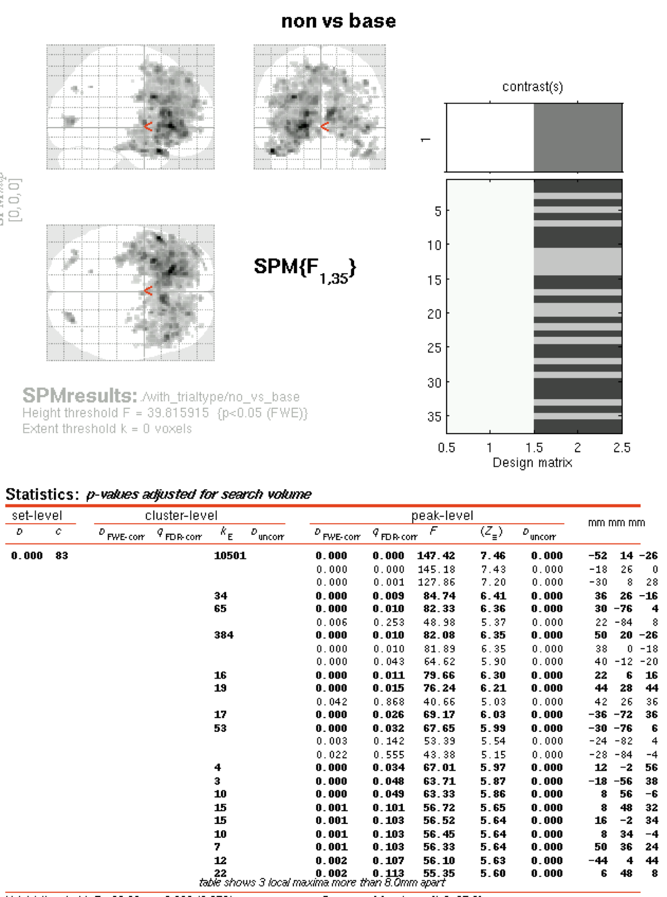

# Preprocessing

## Steps & Settings
The following pipeline was used:  
1. Motion correction (folder: *Realignment*).   
Settings:  
**Estimate**    

*  Quality: 0.9  
* Separation: 4 
* Smoothing (FWHM): 5
* Num passes: Register to mean
* Interpolation: 2nd Degree B-Spline
* Wrapping: No wrap
* Weighting: 0 files

**Reslice**  

* Resliced images: All images + mean image
* Interpolation: 4th Degree B-Spline
* Wrapping: No wrap
* Masking: mask images

2. Coregistration (folder: *Coregistration*)   
Settings:  
**Estimate**

* Objective function: mutual information
* Separation: [4 2]
* Tolerances: left as default 1x12 array
* Histogram smoothing: [5 5]

**Reslice**

* Interpolation: trilinear
* Wrapping: no wrap
* Masking: Don't mask images

3. Segmentation (of structural only; folder: *Segmentation*)  
Settings:  
**Output files**

* Grey matter: native space
* White matter: native space
* CSF: native space
* Bias corrected: Save bias corrected
* Clean up partitions: don't do cleanup

**Custom**

* Tissue probability maps: 3 files
* Gaussians per class: [2 2 2 4]
* Affine regularization: ICBM space template - European brains
* Warping regularization: 1
* Warp frequency cutoff: 25
* Bias regularization: very light (0.0001)
* Bias FWHM: 60 mm cutoff
* Sampling distance: 3
* Masking image: none

4. Normalization (folder: *Normalization*)   
Settings:  
**Estimation options**

* Template image: T1.nii,1
* Template weighting image: 0 files
* Source image smoothing: 8
* Template image smoothing: 0
* Affine regularization: ICBM space template
* Nonlinear frequency cutoff: 25
* Nonlinear iterations: 16
* Nonlinear regularization: 1

**Writing options**

* Perserve: concentrations
* Bounding box: [-78 -112 -50]
* Voxel sizes: [2 2 2]
* Interpolation: trilinear
* Wrapping: no wrap

5. Smoothing (folder: *Smoothing*)  
Settings:  

* FWHM: [4 4 4]; note that this is different from the default 6
* Data type: same
* Implicit masking: no

Each step was checked visually before progressing to the next one.

## Subjects excluded after prepro

* 2 for oddly shaped brain/failed motion correction  
* 9 for failed motion correction  
* 10 for abnormally large ventricles  
* 26 for behavioral abnormalities  
* 32 for uncorrectable rotation  

## Art repair  
Artifact repair was done using the Gabrieli lab's ArtRepair toolbox, available for free online. As Lester suggested, I used the _art global_ script to repair the already preprocessed images.  
Because the end-stage preprocessed images are found in the "Smoothing" folder, the artifact repaired images appear in "Smoothing" for each subject, but they have a "v" added to the prefix.

Note: this program needs to be run separately for each scan; that means it has to be run 4 times for each subject.

I created a matlab script, now found in the Art Repair folder on the Acropolis server (mnt/ide0/share/hcnlab/spm8/ArtRepair v5b), called _artglobal loop_. This script loops through each subject and through each of the 4 scans, running _art global_ separately, with defaults in place, each time. It spits out warnings when over 25% of the data in that scan were repaired (as per Lester's suggestion of 25%) so that the user can go back, change the threshold, and re-run those separately.  

Only a few subjects showed runs that exceeded this threshold: 

* Subject 12 run 3; based on Lester's notes and the high but below threshold number of corrected volumes in other runs, I am going to exclude this subject from further analysis.    
* Subject 17 run 3; re-ran with a different threshold.

Some other subjects showed lots of corrected volumes but below threshold. These included:  

* Subject 16 runs 3 and 4; based on Lester's notes it seems like a good idea to exclude this one.  
* Subject 20 run 1 only; I will keep this subject unless things look strange.  

### Re-run of subject 17, run 3
Used the GUI to adjust the threshold as follows:  


# First-level analysis

## With art repair, without motion regressors
The options I used were:

* Units: seconds
* Interscan interval: 2 (same as TR)
* Microtime resolution: 16 (default)
* Microtime onset: 1 (default)
* High pass filter: 420 seconds
* Basis functions: canonical HRF with no derivatives
* Volterra: do not model interactions
* Global normalization: none
* Explicit mask: none
* Serial correlations: AR(1)


The design matrix looks like this:


This shows that each run of 210 scans was treated as a separate condition.

### Making the "multiple conditions" .mat file

* One file for agency first condition, one for non-first condition  
* Names set to cell array with "agency 1", "agency 2", "non-agency 1", and "non-agency 2" blocks for agency first; flipped for non-agency first.
* Onsets set to 0, 420, 840, and 1260  
* Durations set to 420 only  
* Saved as */mnt/ide0/share/hcnlab/agency/nifti/001/Specify model 1/params_ ag_ first.mat*, and */mnt/ide0/share/hcnlab/agency/nifti/001/Specify model 1/params_ nonag_ first.mat*

### Running batch option
This stage can be run as a loop through subjects using the *batch_ firstlevel.m* script found in *mnt/ide0/share/hcnlab/agency/nifti/001/Specify model 1*.

### First-pass examination of level 1 results

**3 "contrasts" defined**  
1. Agency > non-agency (subtracts activation from non-agency from activation from agency condition, showing where the brain is MORE active, as measured by blood flow, for agency).  
For agency first, vector is: [1 1 -1 -1 0]  
For non-agency first, vector is: [-1 -1 1 1 0]

2. Agency vs. baseline (shows where brain is active for agency, regardless of other conditions)  
For agency first, vector is: [1 1 0 0 0]  
For non-agency first, vector is: [0 0 1 1 0]

3. Non-agency vs. baseline (shows where brain is active for non-agency, regardless of other conditions)  
For agency first, vector is: [0 0 1 1 0]  
For non-agency first, vector is: [1 1 0 0 0]

**Other options**

* Apply masking: none
* p value adjustment: none
* Threshold T/p value: 0.001
* Extent threshold: 0 voxels (will count ANY activation, doesn't have to be a certain size)
* Folder: this is in the folder *Specify model 1* for each subject.

## Repetition of first-level analysis with art repair AND motion regressors
Even though the results made sense without the motion regressors I was curious to see if they would be improved or changed by adding motion regressors (e.g. using the rp*.txt files generated at the Realign phase of preprocessing as multiple regressors).

This is in the folder *Specify model 2* for each subject.

### Batch processing
To do this, I edited the *batch_ firstlevel.m* script to loop through all the subjects but add the regressors.

### Results
I examined the same contrasts as before, with the same options.


## Repetition of first-level analysis with motion regressors but NO art repair
Based on some odd-looking brains that came out of the first-level analysis with art repair, I decided to try this again but not do art repair, instead excluding subjects that had motion issues. See below for the expanded list of excluded subjects.

This is in the folder *Specify model 3* for each subject.

### Batch processing
To do this, I edited the *batch_ firstlevel.m* script to loop through all the subjects but add the regressors.

### Results
I examined the same contrasts as before, with the same options.

##Repetition of first-level with trial types as events
I used the built-in batch editor GUI to add each of the 3 trial types (lev, self, and dic) as separate conditions to the first level model. This means there were 12 conditions: 3 trial types x 4 blocks (agency1/2 and non-agency 1/2).
The associated files for this analysis (e.g. the SPM.mat) are inside the folder *...nifti/subj#/Specify model 2/Design_ 4block/with_ trialtype*.

The design matrix now looks like this (example=subject 3):


To look at individual trial types, there is a csv file:  
*mnt/ide0/share/hcnlab/agency/documents/dga3_ behav/trials/dga3options.csv*

###Batch processing
I added options to my *batch_ firstlevel.m* script to add these trial types for each subject.

### Results
I examined the same contrasts as before, with the same options.

#Second-level analysis
## Filenames and location

Files for second-level analysis are the contrasts created in first-level. These were added to a separate "2nd level" folder for easy access, and the subject number was appended to the contrast filename like this:  
*con_ 0001_ subj#.img*. 

Guide to these files:

The main 2nd level folder is: */mnt/ide0/hcnlab/agency/nifti/2ndlev_ 1*

Within this, there are: 

1. First analysis, with simple 4-block first-level design that does not take trial type or subject response into account:  
*ag_ over_ no*: contains contrasts from all included subjects for agency > non-agency (numbered con_0001)  
*ag_ vs_ base*: contains agency vs. baseline contrasts (numbered con_0002)  
*no_ vs_ base*: contains non-agency vs. baseline contrasts (numbered con_0003)    

2. Second analysis: taking block order per subject into account at the second level.

This just consists of a folder with some regressions called *order* inside the *2ndlev_1* folder


3. Third analysis: taking trial type (leveraging etc.) into account:  
These are located in the subfolder *2ndlev_1 > with_trialtype*.  

Inside this folder, there are:  
*ag_ over_ no*: agency > non (con_0001)  
*ag_ vs_ base*: agency vs. baseline (con_0002)  
*no_ vs_ base*: non-agency vs. baseline (con_0003)  
*no_ over_ag*: non-agency > agency (con_0004)  
*lev_ vs_ base*: leveraging vs. baseline (con_0005)  
*self_ vs_ base*: self vs. baseline (con_0006)  
*dic_ vs_ base*: dic vs. baseline (con_0007)  
*lev_ over_ other*: leveraging > other trials (con_0008)  
*self_ over_ other*: self > other trials (con_0009)  
*dic_ over_ other*: dic > other trials (con_0010)  

Inside each of these there are both *with order* and *without order* folders; this didn't make much of a difference so going forward I will just go ahead and model block order.

4. Fourth analysis: looking only at subjects who made some prosocial decisions. These are located in the subfolder *2ndlev_1 > prosocial > with_ order > with_ trialtype*. The contrasts and subfolders here are the same as they were for the 3rd analysis.


5. Fifth analysis: taking prosocial decisions, as well as trial type and blocks, into account: 

Things got tricky at this level, because not all subjects were prosocial in all of the conditions. Therefore, each subject had a different number of conditions. The full range would have been 24 conditions: 3 trial types x 4 blocks x prosocial/not...but almost nobody was prosocial in every trial type in every block. In general, the "self" and "dic" type trials often lacked any prosocial trials at all.

## Settings 
To obtain the second-level contrasts, I followed the tutorial in the SPM8 manual closely. For each condition (e.g. agency vs. baseline), I made an F contrast with weights matrix = 1.

* Apply masking: none
* p value adjustment: none
* Threshold T/p value: 0.000001 for comparisons with baseline; 0.025 for agency > non-agency contrast
* Extent threshold: 0 voxels for comparisons with baseline; 5 voxels for agency > non-agency contrast because so many one or two-voxel locations were lighting up

## Modeling order effects
Lester suggested I model block order effects at the second level, as shown in the following pictures.

## Pictures

These are second-level contrasts for a first-level analysis that:  
* Included trial type (3 kinds)  
* Included 4 blocks: 2 agency and 2 non-agency  
* Included all subjects

###Agency vs. baseline


###Non-agency vs. baseline


###Agency > non-agency


##Interpretation of active brain areas

The "versus baseline" contrasts give us a nice reality check. Because this task involves reading information on a screen, we should see activity in visual areas, which is obvious in both agency vs. baseline and non-agency vs. baseline. Because it involves pretty sophisticated decision-making, we should also see a great deal of frontal activation, which we also see in both "versus baseline" cases.

### Converting MNI to TAL and area lookup  
The coordinates in SPM are MNI coordinates. These need to be converted to Talairach in order to look them up in the Brede database. I used [a website from the BioImage suite at Yale](http://sprout022.sprout.yale.edu/mni2tal/mni2tal.html) to convert MNI to TAL.

I then used the [Brede database](http://neuro.imm.dtu.dk/cgi-bin/brede_loc_query.pl?q=) to look up the TAL coordinates and what areas they correspond with in the literature.

#### Areas implicated in literature

The following papers (from Shoham) are being used as a guide. 

+ Hutcherson et. al. 2015 **A neurocomputational model of altruistic choice and its implications**
+ Strombach et. al. 2015 **Social discounting involves modulation of neural value signals by temporoparietal junction**
+ Fehr & Camerer 2007 **Social neuroeconomics: the neural circuitry of social preferences**

I looked at the names of the main areas implicated in these papers, then did a literature search to define the borders of these areas. I then compared the coordinates identified in my second-level analysis to the lists of coordinates as defined in many different papers. 

####Areas we found to be active


# ROI analysis with MarsBaR
One problem with the second-level analysis was that when FWE-corrected p values were used, no activation could be seen (due to too much variance throughout the brain). This happened regardless of whether block order was a regressor or not. This means that ROI masks need to be used to isolate areas of interest (based on the literature and on the preliminary results obtained with uncorrected p values). This will prevent variance from all over the brain from washing out our effect.

## Downloads
Marsbar-0.44 was already present on Acropolis. To use MARSBaR's pre-made ROIs, I downloaded marsbar-aal-0.2 from their [recommended website](http://sourceforge.net/projects/marsbar/files/marsbar%20AAL%20ROIs/0.2/). These are used for strucural ROIs when functionals are not available (as in our case).

## MARSBaR first level
I used each subject's first-level SPM.mat file to specify the design; the Graphics window verified that the design had been correctly imported.

I used MarsBar's batch code from their [support website](http://marsbar.sourceforge.net/faq.html#how-do-i-run-a-marsbar-analysis-in-batch-mode) to run the ROIs for all the subjects, across all four of the preliminary contrasts:

* agency > non
* non > agency
* agency vs. baseline
* non vs. baseline

###ROIs used: Marsbar's own

See "downloads" section above; I used a huge loop to go through all the ROIs that looked related to ones implicated in the literature (e.g. orbitofrontal, etc.) plus ones that looked like (upon visual examination with a non-corrected p-value threshold) like they were active in the contrast (temporal areas). This came to a total of 46 ROIs (bolded = approaching significance)

MNI_ Caudate_ L_ roi.mat  
MNI_ Caudate_ R_ roi.mat  
MNI_ Cingulum_ Ant_ L_ roi.mat  
MNI_ Cingulum_ Ant_ R_ roi.mat  
MNI_ Cingulum_ Mid_ L_ roi.mat  
MNI_ Cingulum_ Mid_ R_ roi.mat  
MNI_ Cingulum_ Post_ L_ roi.mat  
MNI_ Cingulum_ Post_ R_ roi.mat  
MNI_ Cuneus_ L_ roi.mat  
MNI_ Cuneus_ R_ roi.mat  
**MNI_ Frontal_ Inf_ Oper_ L_ roi.mat** (p=0.07)  
**MNI_ Frontal_ Inf_ Oper_ R_ roi.mat** (p=0.05)  
**MNI_ Frontal_ Inf_ Orb_ L_ roi.mat** (p=0.06)  
**MNI_ Frontal_ Inf_ Orb_ R_ roi.mat** (p=0.07)  
**MNI_ Frontal_ Inf_ Tri_ L_ roi.mat** (p=0.05)  
**MNI_ Frontal_ Inf_ Tri_ R_ roi.mat** (p=0.07)  
MNI_ Frontal_ Med_ Orb_ L_ roi.mat  
MNI_ Frontal_ Med_ Orb_ R_ roi.mat  
MNI_ Frontal_ Mid_ L_ roi.mat  
MNI_ Frontal_ Mid_ R_ roi.mat    
MNI_ Frontal_ Mid_ Orb_ L_ roi.mat   
MNI_ Frontal_ Mid_ Orb_ R_ roi.mat  
MNI_ Frontal_ Sup_ L_ roi.mat  
MNI_ Frontal_ Sup_ R_ roi.mat  
MNI_ Frontal_ Sup_ Medial_ L_ roi.mat  
MNI_ Frontal_ Sup_ Medial_ R_ roi.mat  
MNI_ Frontal_ Sup_ Orb_ L_ roi.mat  
MNI_ Frontal_ Sup_ Orb_ R_ roi.mat  
MNI_ Insula_ L_ roi.mat  
MNI_ Insula_ R_ roi.mat  
MNI_ Precuneus_ L_ roi.mat  
MNI_ Precuneus_ R_ roi.mat  
MNI_ Putamen_ L_ roi.mat  
MNI_ Putamen_ R_ roi.mat  
**MNI_ Temporal_ Inf_ L_ roi.mat** (p=0.08)  
MNI_ Temporal_ Inf_ R_ roi.mat   
MNI_ Temporal_ Mid_ L_ roi.mat  
MNI_ Temporal_ Mid_ R_ roi.mat  
MNI_ Temporal_ Pole_ Mid_ L_ roi.mat  
MNI_ Temporal_ Pole_ Mid_ R_ roi.mat  
MNI_ Temporal_ Pole_ Sup_ L_ roi.mat  
MNI_ Temporal_ Pole_ Sup_ R_ roi.mat  
MNI_ Temporal_ Sup_ L_ roi.mat  
MNI_ Temporal_ Sup_ R_ roi.mat  
MNI_ Occipital_ Inf_ L_ roi.mat  
MNI_ Occipital_ Inf_ R_ roi.mat  


###ROIs used: Neurosynth

I used neurosynth to make ROIs for the following areas, which were pulled out from the literature on decision making, prosociality, etc.:

+ Anterior cingulate (searched "acc")
+ Dorsal anterior cingulate (searched "dacc")
+ _Paracingulate cortex - searched but no results in Neurosynth_
+ Caudate
+ Precuneus
+ VMPFC
+ VLPFC
+ DMPFC
+ DLPFC
+ MPFC
+ Anterior prefrontal
+ Orbitofrontal cortex
+ Medial orbitofrontal
+ Striatum
+ Ventral striatum
+ Anterior insula
+ Nucleus accumbens
+ _Ventral tegmental area - searched but no results in Neurosynth_
+ Subgenual area (searched "subgenual")
+ Posterior STS (searched "psts")
+ Temporoparietal junction
+ Putamen
+ Amygdala

In order to make ROIs from Neurosynth, one does the following steps:

1. Go to neurosynth.org  
2. Click on Meta-analysis > Terms at the top bar  
3. Type the term of interest (e.g. "ventral striatum") in the search bar  
4. Click on the hyperlink that is returned by the result; some images showing red activation maps for the ROI should pop up  
5. In the "Layers" bar on the right side, look for "ROI: reverse inference". Click the download arrow next to that to download a .nii file.   
6. The ROIs are downloaded as .nii.gz files that can easily be expanded by double clicking (at least on a Mac)  
7. In MarsBar, click "Import" for ROI and import the .nii file. Click through the GUI and an ROI will be created automatically.

### Parameters to investigate
I wrote 2 small scripts to do the following:   
1. Fish out the ROIs and their P values  
2. Fish out the significant ROIs and their P values < 0.05
These scripts save the subject name, ROI identity, and P value in a text file that can be copy-pasted into excel, etc.

I also used code from the [MarsBar FAQ page](http://marsbar.sourceforge.net/faq.html#how-do-i-extract-percent-signal-change-from-my-design-using-batch) to extract percent signal change from the data in batch mode.   
Out of all the possible parameters of interest, it seems that **percent signal change** is the parameter of interest for us. I added code in my script to save the percent signal change for each block, each ROI, and each subject.

## MARSBaR second level
Using the data generated from first-level analysis, containing percent signal change for each block, I did the following:

+ For each subject and each ROI, average together the "agency" and "non-agency" blocks to get one agency % signal change and one non-agency % signal change  
+ For each ROI, use R to perform a paired t-test between agency and non-agency (n=37 usable subjects)

A paired t test was used because the same subjects are being scanned twice: once in an agency condition and once in a non-agency condition.

The following code in R was used to loop through all 46 ROIs examined, given percent signal change data:

```{r, eval=FALSE}
for (i in 1:46){
  temp=t.test(data[1:38,i],data[39:76,i],alternative=c("two.sided"),mu=0,paired=TRUE,var.equal=FALSE,conf.level=0.95)
  pval[i]=temp[[3]]
  rm(temp)
}

write.table(pval,"pavlues_ROIttest.txt", sep="\t")
```

###Results
No areas reached the significance threshold of p<0.05, however some came close.

These are:  
IFG opercular (p=0.079 left, p=0.076 right)  
IFG orbital (p=0.067 left, p=0.081 right)  
IFG triangular, left (p=0.066)
Inferior temporal, left only (p=0.069)  

### Repetition of second-level with Neurosynth ROIs
This pulled out the following ROIs:  
anterior insula (p=0.088)  
DLPFC (p=0.016)  

Note that Neurosynth ROIs are necessarily bilateral already.

### Repetition of second-level with only prosocial subjects

Subjects that were never or rarely prosocial (see below in the Subjects section) were removed from the .csv file read into R, and the analysis was repeated (sample size is now n=34).

```{r,eval=FALSE}
for (i in 1:46){
  temp=t.test(data[1:34,i],data[35:68,i],alternative=c("two.sided"),mu=0,paired=TRUE,var.equal=FALSE,conf.level=0.95)
         pval[i]=temp[[3]]
         rm(temp)
         }
         
         write.table(pval,"pavlues_ROIttest_proonly.txt", sep="\t")
```

Looking at only prosocial subjects, one area now reaches significance:  
Mid temporal pole, right (p=0.043)  

Other areas are close:  
IFG opercular (p=0.097 left, p=0.070 right)  
IFG orbital (p=0.065 left, p=0.088 right)  
IFG triangular (p=0.056 left, p=0.084 right)  
Inferior temporal, left (p=0.087)  

## On FWE vs. conventional significance levels with ROI analysis

As stated in [Schweizer et. al. 2013](http://www.jneurosci.org/content/33/12/5301.full), using an ROI analysis makes looking at corrected P values unnecessary:

"(1) the ROI under consideration are clearly derived from the literature a priori; and (2) averaging across all voxels within an anatomically defined ROI is itself very conservative because included in the average will likely be sizeable clusters of voxels not activated by the relevant contrast. Such averaging already therefore biases toward the null hypothesis, and additional correction for multiple tests would make the significance threshold very stringent indeed (Poldrack, 2007)."

#Participant information

## Excluded for data when art repair is used
2, 9, 10, 12, 13, 16, 26, 32

## Excluded when art repair is not used
2, 9, 10, 12, 16, 17, 26, 32, 37, 38, 43, 45 (everyone on Lester's list of people who may have had motion issues)

## Block order
Agency first: 2, 4, 6, 8, 10, 12, 14, 16, 18, 19, 21, 23, 25, 26, 28, 30, 32, 34, 36, 39, 41, 43

Non-agency first: 1, 3, 5, 7, 9, 11, 13, 15, 17, 20, 22, 24, 27, 29, 31, 33, 35, 37, 38, 40, 42, 44, 45

## Unusual, but still included
35: had only 171 scans in run 4

## Never prosocial
Accessible in column "O" of the subject info spreadsheet *dga_ mri_ costrationbeh_ noinit.csv*

* Subject 24

## Rarely prosocial

* Subject 1 (one prosocial decision)
* Subject 8 (one prosocial decision)
* Subject 3 (7 prosocial decisions)

## No behavioral data

* Subject 13 (file was corrupted due to computer malfunction during data collection; excluding this subject)


