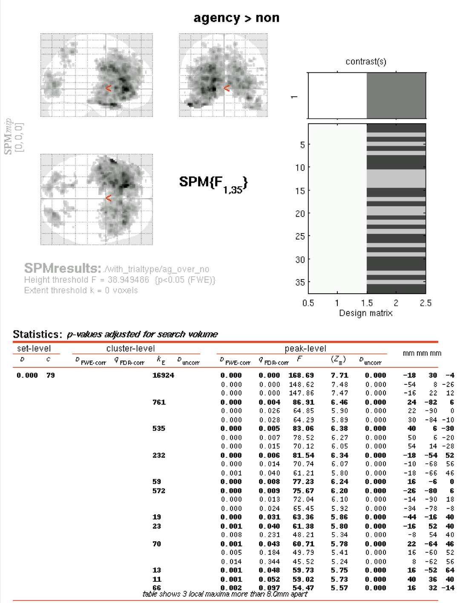

# Preprocessing

## Steps & Settings
The following pipeline was used:  
1. Motion correction (folder: *Realignment*).   
Settings:  
**Estimate**    

*  Quality: 0.9  
* Separation: 4 
* Smoothing (FWHM): 5
* Num passes: Register to mean
* Interpolation: 2nd Degree B-Spline
* Wrapping: No wrap
* Weighting: 0 files

**Reslice**  

* Resliced images: All images + mean image
* Interpolation: 4th Degree B-Spline
* Wrapping: No wrap
* Masking: mask images

2. Coregistration (folder: *Coregistration*)   
Settings:  
**Estimate**

* Objective function: mutual information
* Separation: [4 2]
* Tolerances: left as default 1x12 array
* Histogram smoothing: [5 5]

**Reslice**

* Interpolation: trilinear
* Wrapping: no wrap
* Masking: Don't mask images

3. Segmentation (of structural only; folder: *Segmentation*)  
Settings:  
**Output files**

* Grey matter: native space
* White matter: native space
* CSF: native space
* Bias corrected: Save bias corrected
* Clean up partitions: don't do cleanup

**Custom**

* Tissue probability maps: 3 files
* Gaussians per class: [2 2 2 4]
* Affine regularization: ICBM space template - European brains
* Warping regularization: 1
* Warp frequency cutoff: 25
* Bias regularization: very light (0.0001)
* Bias FWHM: 60 mm cutoff
* Sampling distance: 3
* Masking image: none

4. Normalization (folder: *Normalization*)   
Settings:  
**Estimation options**

* Template image: T1.nii,1
* Template weighting image: 0 files
* Source image smoothing: 8
* Template image smoothing: 0
* Affine regularization: ICBM space template
* Nonlinear frequency cutoff: 25
* Nonlinear iterations: 16
* Nonlinear regularization: 1

**Writing options**

* Perserve: concentrations
* Bounding box: [-78 -112 -50]
* Voxel sizes: [2 2 2]
* Interpolation: trilinear
* Wrapping: no wrap

5. Smoothing (folder: *Smoothing*)  
Settings:  

* FWHM: [4 4 4]; note that this is different from the default 6
* Data type: same
* Implicit masking: no

Each step was checked visually before progressing to the next one.

## Subjects excluded after prepro

* 2 for oddly shaped brain/failed motion correction  
* 9 for failed motion correction  
* 10 for abnormally large ventricles  
* 26 for behavioral abnormalities  
* 32 for uncorrectable rotation  

## Art repair  
Artifact repair was done using the Gabrieli lab's ArtRepair toolbox, available for free online. As Lester suggested, I used the _art global_ script to repair the already preprocessed images.  
Because the end-stage preprocessed images are found in the "Smoothing" folder, the artifact repaired images appear in "Smoothing" for each subject, but they have a "v" added to the prefix.

Note: this program needs to be run separately for each scan; that means it has to be run 4 times for each subject.

I created a matlab script, now found in the Art Repair folder on the Acropolis server (mnt/ide0/share/hcnlab/spm8/ArtRepair v5b), called _artglobal loop_. This script loops through each subject and through each of the 4 scans, running _art global_ separately, with defaults in place, each time. It spits out warnings when over 25% of the data in that scan were repaired (as per Lester's suggestion of 25%) so that the user can go back, change the threshold, and re-run those separately.  

Only a few subjects showed runs that exceeded this threshold: 

* Subject 12 run 3; based on Lester's notes and the high but below threshold number of corrected volumes in other runs, I am going to exclude this subject from further analysis.    
* Subject 17 run 3; re-ran with a different threshold.

Some other subjects showed lots of corrected volumes but below threshold. These included:  

* Subject 16 runs 3 and 4; based on Lester's notes it seems like a good idea to exclude this one.  
* Subject 20 run 1 only; I will keep this subject unless things look strange.  

### Re-run of subject 17, run 3
Used the GUI to adjust the threshold as follows:  

# First-level analysis

## With art repair, without motion regressors
The options I used were:

* Units: seconds
* Interscan interval: 2 (same as TR)
* Microtime resolution: 16 (default)
* Microtime onset: 1 (default)
* High pass filter: 420 seconds
* Basis functions: canonical HRF with no derivatives
* Volterra: do not model interactions
* Global normalization: none
* Explicit mask: none
* Serial correlations: AR(1)

The design matrix looks like this:

This shows that each run of 210 scans was treated as a separate condition.

### Making the "multiple conditions" .mat file

* One file for agency first condition, one for non-first condition  
* Names set to cell array with "agency 1", "agency 2", "non-agency 1", and "non-agency 2" blocks for agency first; flipped for non-agency first.
* Onsets set to 0, 420, 840, and 1260  
* Durations set to 420 only  
* Saved as */mnt/ide0/share/hcnlab/agency/nifti/001/Specify model 1/params_ ag_ first.mat*, and */mnt/ide0/share/hcnlab/agency/nifti/001/Specify model 1/params_ nonag_ first.mat*

### Running batch option
This stage can be run as a loop through subjects using the *batch_ firstlevel.m* script found in *mnt/ide0/share/hcnlab/agency/nifti/001/Specify model 1*.

### First-pass examination of level 1 results

**3 "contrasts" defined**  
1. Agency > non-agency (subtracts activation from non-agency from activation from agency condition, showing where the brain is MORE active, as measured by blood flow, for agency).  
For agency first, vector is: [1 1 -1 -1 0]  
For non-agency first, vector is: [-1 -1 1 1 0]

2. Agency vs. baseline (shows where brain is active for agency, regardless of other conditions)  
For agency first, vector is: [1 1 0 0 0]  
For non-agency first, vector is: [0 0 1 1 0]

3. Non-agency vs. baseline (shows where brain is active for non-agency, regardless of other conditions)  
For agency first, vector is: [0 0 1 1 0]  
For non-agency first, vector is: [1 1 0 0 0]

**Other options**

* Apply masking: none
* p value adjustment: none
* Threshold T/p value: 0.001
* Extent threshold: 0 voxels (will count ANY activation, doesn't have to be a certain size)
* Folder: this is in the folder *Specify model 1* for each subject.

## Repetition of first-level analysis with art repair AND motion regressors
Even though the results made sense without the motion regressors I was curious to see if they would be improved or changed by adding motion regressors (e.g. using the rp*.txt files generated at the Realign phase of preprocessing as multiple regressors).

This is in the folder *Specify model 2* for each subject.

### Batch processing
To do this, I edited the *batch_ firstlevel.m* script to loop through all the subjects but add the regressors.

### Results
I examined the same contrasts as before, with the same options.

## Repetition of first-level analysis with motion regressors but NO art repair
Based on some odd-looking brains that came out of the first-level analysis with art repair, I decided to try this again but not do art repair, instead excluding subjects that had motion issues. See below for the expanded list of excluded subjects.

This is in the folder *Specify model 3* for each subject.

### Batch processing
To do this, I edited the *batch_ firstlevel.m* script to loop through all the subjects but add the regressors.

### Results
I examined the same contrasts as before, with the same options.

#Second-level analysis
## Filenames and location

Files for second-level analysis are the contrasts created in first-level. These are numbered as follows:

For agency > non-agency contrast:  
*con_ 0001_ subj#.img* is saved in */mnt/ide0/hcnlab/agency/nifti/2ndlev_ 1/ag_ over_ no/*  

For agency vs. baseline:  
*con_ 0002_ subj#.img* is saved in */mnt/ide0/hcnlab/agency/nifti/2ndlev_ 1/ag_ vs_ base/*  

For non-agency vs. baseline:  
*con_ 0003_ subj#.img* is saved in */mnt/ide0/hcnlab/agency/nifti/2ndlev_ 1/no_ vs_ base/*  

## Settings 
To obtain the second-level contrasts, I followed the tutorial in the SPM8 manual closely. For each condition (e.g. agency vs. baseline), I made an F contrast with weights matrix = 1.

* Apply masking: none
* p value adjustment: none
* Threshold T/p value: 0.000001 for comparisons with baseline; 0.025 for agency > non-agency contrast
* Extent threshold: 0 voxels for comparisons with baseline; 5 voxels for agency > non-agency contrast because so many one or two-voxel locations were lighting up

## Pictures

###Agency vs. baseline

###Non-agency vs. baseline

###Agency > non-agency

##Interpretation of active brain areas

The "versus baseline" contrasts give us a nice reality check. Because this task involves reading information on a screen, we should see activity in visual areas, which is obvious in both agency vs. baseline and non-agency vs. baseline. Because it involves pretty sophisticated decision-making, we should also see a great deal of frontal activation, which we also see in both "versus baseline" cases.

### Converting MNI to TAL and area lookup  
The coordinates in SPM are MNI coordinates. These need to be converted to Talairach in order to look them up in the Brede database. I used [a website from the BioImage suite at Yale](http://sprout022.sprout.yale.edu/mni2tal/mni2tal.html) to convert MNI to TAL.

I then used the [Brede database](http://neuro.imm.dtu.dk/cgi-bin/brede_loc_query.pl?q=) to look up the TAL coordinates and what areas they correspond with in the literature.

#### Areas implicated in literature

The following papers (from Shoham) are being used as a guide. 

+ Hutcherson et. al. 2015 **A neurocomputational model of altruistic choice and its implications**
+ Strombach et. al. 2015 **Social discounting involves modulation of neural value signals by temporoparietal junction**
+ Fehr & Camerer 2007 **Social neuroeconomics: the neural circuitry of social preferences**

I looked at the names of the main areas implicated in these papers, then did a literature search to define the borders of these areas. I then compared the coordinates identified in my second-level analysis to the lists of coordinates as defined in many different papers. 

Another approach is to use **Neurosynth** to generate automated meta-analyses; I am looking into this currently.

# ROI analysis with MarsBaR
One problem with the second-level analysis was that when FWE-corrected p values were used, no activation could be seen (due to too much variance throughout the brain). This means that ROI masks need to be used to isolate areas of interest (based on the literature and on the preliminary results obtained with uncorrected p values). This will prevent variance from all over the brain from washing out our effect.

## Downloads
Marsbar-0.44 was already present on Acropolis. To use MARSBaR's pre-made ROIs, I downloaded marsbar-aal-0.2 from their [recommended website](http://sourceforge.net/projects/marsbar/files/marsbar%20AAL%20ROIs/0.2/). These are used for strucural ROIs when functionals are not available (as in our case).

## MARSBaR first level
I used each subject's first-level SPM.mat file to specify the design; the Graphics window verified that the design had been correctly imported.

I used MarsBar's batch code from their [support website](http://marsbar.sourceforge.net/faq.html#how-do-i-run-a-marsbar-analysis-in-batch-mode) to run the ROIs for all the subjects, across all four of the preliminary contrasts:

* agency > non
* non > agency
* agency vs. baseline
* non vs. baseline

Then I wrote 2 small scripts:  
1. Fish out the ROIs and their P values  
2. Fish out the significant ROIs and their P values < 0.05
These scripts save the subject name, ROI identity, and P value in a text file that can be copy-pasted into excel, etc.

## MARSBaR second level

#Participant information

## Excluded for data when art repair is used
2, 9, 10, 12, 16, 26, 32

## Excluded when art repair is not used
2, 9, 10, 12, 16, 17, 26, 32, 37, 38, 43, 45 (everyone on Lester's list of people who may have had motion issues)

## Block order
Agency first: 2, 4, 6, 8, 10, 12, 14, 16, 18, 19, 21, 23, 25, 26, 28, 30, 32, 34, 36, 39, 41, 43

Non-agency first: 1, 3, 5, 7, 9, 11, 13, 15, 17, 20, 22, 24, 27, 29, 31, 33, 35, 37, 38, 40, 42, 44, 45

## Unusual, but still included

* 13: had only 13 scans in run 4
* 35: had only 171 scans in run 4

